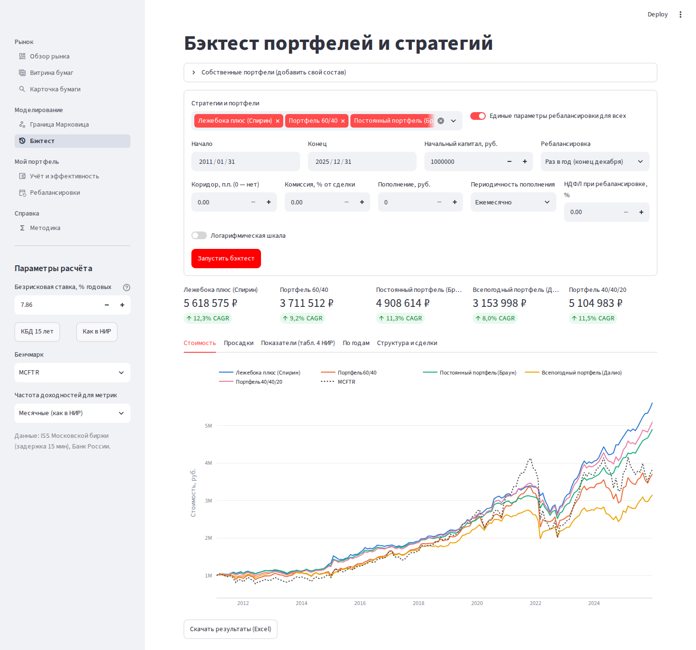
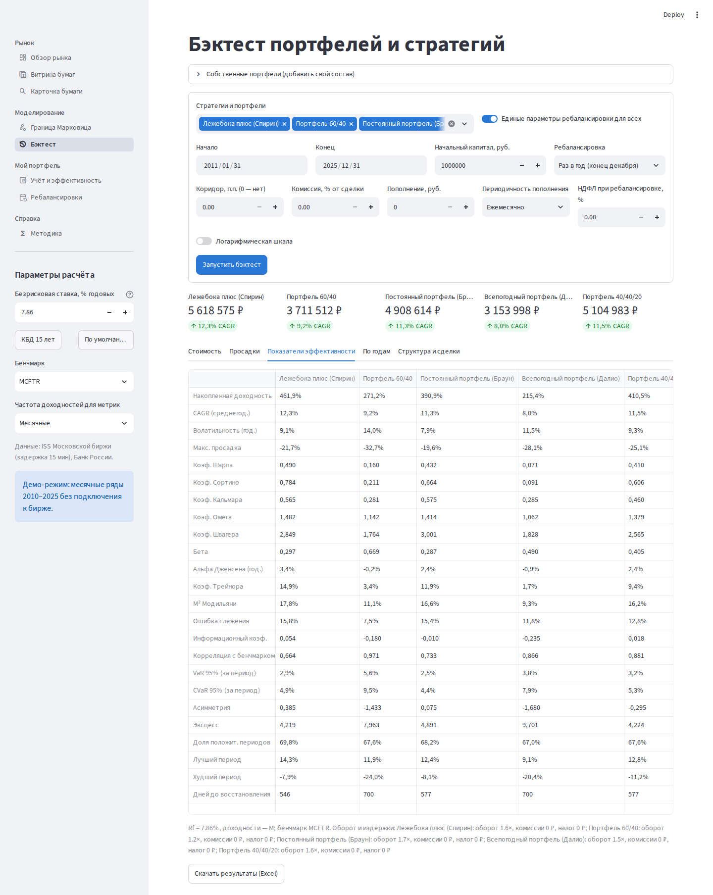
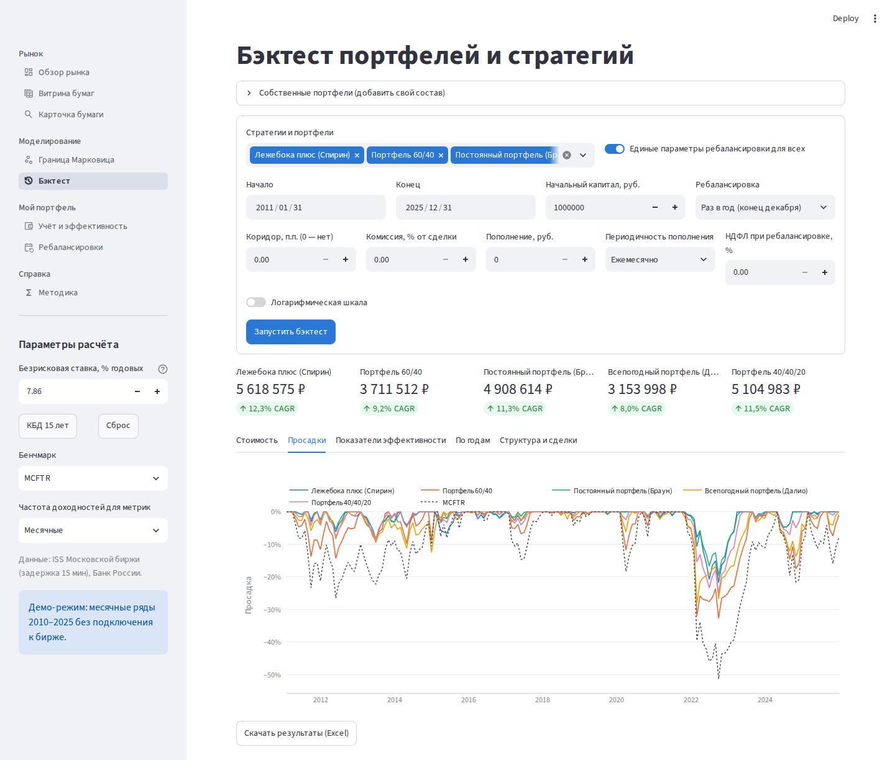
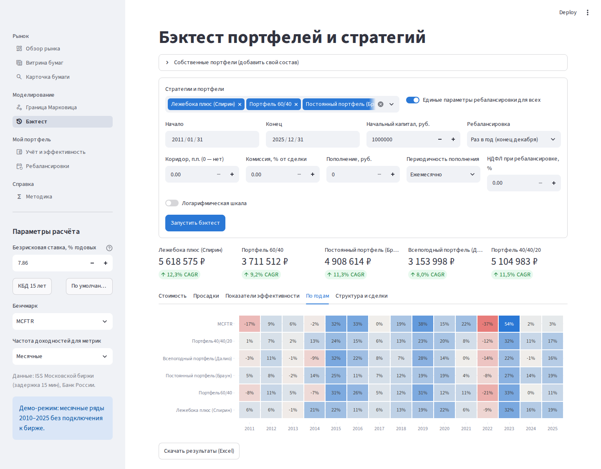
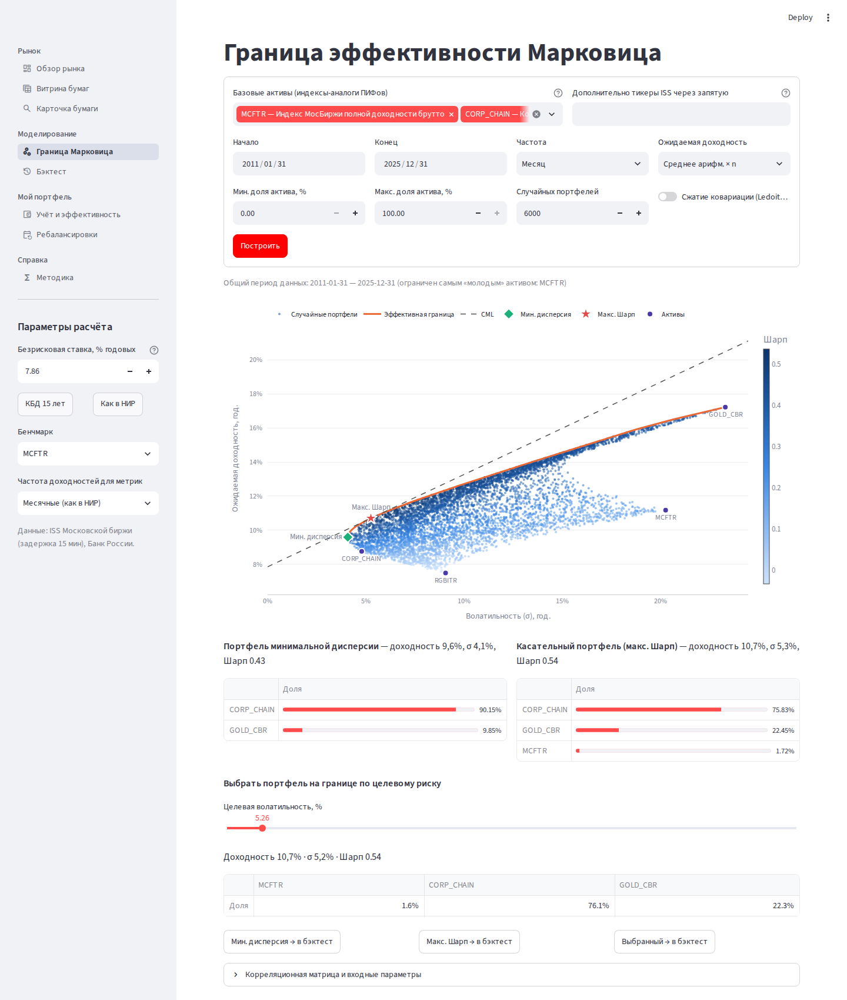
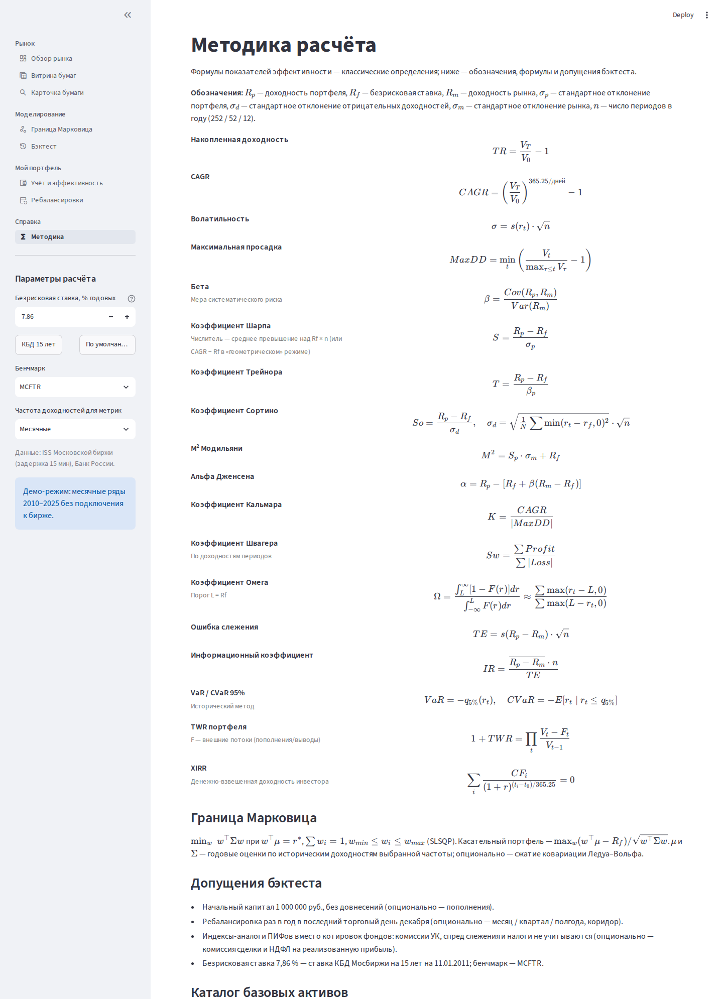

# ИнвестАналитика — MVP

Информационно-аналитическая платформа оценки эффективности инвестиций на российском рынке.
Данные — ISS Московской биржи и Банк России. Две версии интерфейса: веб-сайт (`web/`, HTML/CSS/JS,
расчёты в браузере) и приложение на Streamlit (`app.py`, расчёты в Python, `core/`).

## Как это выглядит

**Бэктест классических пассивных стратегий** (1 млн руб., 2011–2025, ежегодная ребалансировка):



<details>
<summary><b>Ещё экраны бэктеста:</b> показатели эффективности, просадки, доходность по годам</summary>





</details>

**Граница эффективности Марковица:**



<details>
<summary><b>Методика расчёта</b> — формулы всех коэффициентов</summary>



</details>

Скриншоты сняты в демо-режиме (`IP_OFFLINE=1`, месячные ряды из `tests/fixtures`).
Витрина бумаг, карточка бумаги и обзор рынка работают на живых данных ISS и видны после запуска.

## Запуск (macOS)

```bash
cd ~/Documents/InvestPlatform
python3 -m venv .venv && source .venv/bin/activate
pip install -r requirements.txt
streamlit run app.py            # живые данные ISS / ЦБ
IP_OFFLINE=1 streamlit run app.py   # демо без интернета (месячные ряды 2010–2025)
```

Или двойной клик по `run.command` / `run_demo.command` (при первом запуске сам создаст окружение).
Тесты: `pip install -r requirements-dev.txt && python -m pytest -q` (сеть не нужна; для тестов веб-версии нужны Node ≥ 22 и Playwright).

## Онлайн-версия (Streamlit Community Cloud)

1. [share.streamlit.io](https://share.streamlit.io) → **Continue with GitHub**.
2. **Create app** → **Deploy a public app from GitHub**: репозиторий `rudnitskiyds-prog/invest-analytics`,
   ветка `main`, файл `app.py` → **Deploy**.
3. Демо без обращения к бирже: **Settings → Secrets** → `IP_OFFLINE = "1"`.

Если ISS или сайт ЦБ недоступны с серверов Streamlit, базовые ряды (индексы, золото, RUONIA) автоматически
берутся из демо-данных, о чём предупреждает боковая панель. Учёт портфеля в облаке хранится во временной
SQLite: он общий для всех, у кого есть доступ к приложению, и сбрасывается при перезапуске — для
личных портфелей нужен полноценный бэкенд с авторизацией.

## Что умеет

| Раздел | Функции |
|---|---|
| Обзор рынка | ключевые индексы, динамика классов активов за 5 лет, КБД сейчас и год назад |
| Витрина бумаг | акции (TQBR), фонды/паи (БПИФ, ОПИФ, ЗПИФ, ИПИФ), ОФЗ и корп. облигации, металлы, индексы: цена, 1М/3М/YTD/1Г, волатильность, Шарп, Сортино, бета, просадка, капитализация, доходность и дюрация облигаций, мультипликаторы; выгрузка в Excel |
| Карточка бумаги | график против бенчмарка, просадки с датами пика/дна/восстановления, скользящие Шарп/волатильность/бета, доходность по годам, купоны, полный набор коэффициентов |
| Граница Марковица | облако случайных портфелей, эффективная граница (SLSQP), портфель мин. дисперсии, касательный портфель, CML, ограничения на доли, сжатие ковариации Ледуа–Вольфа, выбор портфеля по целевому риску, передача в бэктест |
| Бэктест | 6 классических пассивных стратегий + собственные портфели (индексы, акции, паи, металлы); ребалансировка месяц/квартал/полгода/год и коридор; комиссия, пополнения, НДФЛ; стоимость, просадки, таблица показателей эффективности, тепловая карта по годам, структура и журнал сделок; Excel |
| Мой портфель | учёт операций (SQLite, импорт CSV), позиции по средней цене, P&L, XIRR, TWR против бенчмарка, сравнение с классическими стратегиями на том же отрезке |
| Ребалансировки | целевые доли и правило, календарь (последний рабочий день периода), экспорт .ics с напоминанием, отклонение долей и коридор, заявки с округлением до лотов |
| Методика | формулы всех коэффициентов, каталог базовых активов, составы стратегий |

Коэффициенты: накопленная доходность, CAGR, волатильность, MaxDD, Шарп, Сортино, Кальмар,
Трейнор, M², бета, альфа Дженсена, ошибка слежения, информационный коэф., Омега, Швагер,
VaR/CVaR, асимметрия, эксцесс, срок восстановления, XIRR, TWR.

## Проверка расчётов

Движок покрыт тестами на эталонных месячных рядах ISS и ЦБ 2010–2025 (`tests/fixtures`): итоговые суммы
бэктеста и все коэффициенты фиксируются тестами, а JS-движок веб-версии сверяется с Python до 1e-9.

## Архитектура

```
app.py                     навигация Streamlit
pages/                     8 экранов
ui/common.py               общие элементы, палитра, графики, кэш
core/data/iss.py           клиент ISS MOEX (свечи, история индексов, витрины, КБД, купоны)
core/data/cbr.py           Банк России: золото, RUONIA (индекс ден. рынка), ключевая ставка
core/data/universe.py      каталог базовых активов, склейка индексов, демо-режим
core/data/quotes.py        котировки в рублях за бумагу для учёта
core/data/cache.py         HTTP-кэш в SQLite (история в прошлом — бессрочно)
core/analytics/metrics.py  все коэффициенты
core/analytics/frontier.py граница Марковица
core/analytics/backtest.py движок бэктеста
core/analytics/strategies.py классические пассивные стратегии
core/analytics/screener.py витрина
core/portfolio/ledger.py   учёт портфеля
core/portfolio/rebalance.py календарь и заявки
scripts/                   сборщик данных ЦБ, служебные проверки
web/                       веб-версия: index.html, js/ (интерфейс), lib/ (расчёты), vendor/
tests/                     unit-тесты, фикстуры реальных рядов, смоук-тесты страниц
```

Ядро (`core/`) не зависит от Streamlit — его можно без изменений поставить за FastAPI,
когда понадобится отдельный фронтенд и многопользовательский режим.

## Особенности данных (проверено на ISS в сентябре 2026)

* Свечи индексов на ISS многие начинаются с 2016 г. — индексы грузятся через `history` (с 2003 г.).
* Акции до 2013 г. торговались в режиме EQBR — история склеивается с TQBR автоматически.
* С июня 2026 г. фонды (EQMX, LQDT, GOLD…) переведены из TQTF в TQBR; фонды отделяются по SECTYPE (J, 9, A, B).
* КБД на ISS доступна с 06.01.2014 — поэтому безрисковая ставка по умолчанию (7,86 %, 15-летняя КБД на 11.01.2011) задана константой.
* RUCBITR рассчитывался до 05.2023, RUCBTRNS — с 12.2018; склейка на 29.12.2018 с пересчётом базы.
* Дивиденды, мультипликаторы, сектора акций и комиссии фондов — из T-Invest API (только чтение), раз в сутки
  сборщиком в `public/data/`. Токен — секрет `TINVEST_TOKEN` в GitHub; без него эти источники пропускаются,
  а запасными остаются `data/dividends.csv` и `data/fundamentals.csv`.
* Цены облигаций в валюте (CNY/USD) в учёте пока не пересчитываются в рубли.

## Открытые вопросы

1. **Мультипликаторы.** Источник отчётности: ручной CSV, T-Invest API (GetAssetFundamentals, нужен токен),
   платные Cbonds / Интерфакс?
2. **Формат продукта.** Для личных кабинетов нужны авторизация, PostgreSQL вместо SQLite и бэкенд
   (план — Yandex Cloud).
